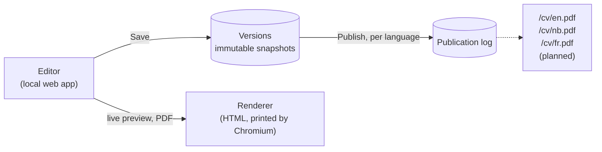

# Core Sample

**One CV, every language, never out of date.** Core Sample is the pipeline behind the CV on [ralanwilliams.com](https://ralanwilliams.com): a single versioned source in PostgreSQL, published per language to links that never change.

A CV usually lives as a pile of copies: the PDF sent last spring, the Word file on the desktop, a translation that missed the last two jobs. Core Sample replaces them with one source of truth. Every save is kept, every language is checked against the others, and `/cv/en.pdf` always serves the current published version, so a link sent to a recruiter never goes stale.

> This repository also holds the website itself, in [`public/`](public/).

## Status

Work in progress. The data layer and the editor are built; public download links come next.

| Part | State |
|---|---|
| Content model and database schema | Done |
| Database rules: history, translations, publishing | Done, with 73 schema tests |
| Migrations to Supabase | Done |
| Editor (edit, save, publish, history, restore) | Done: a local web app ([guide](docs/cv-editor.md)) |
| Renderer (HTML, PDF and Markdown per language) | Done: the editor's preview and downloads, and the files stored on publish |
| Public download links | Designed ([ADR 0003](docs/adr/0003-public-cv-downloads.md)); in progress |

## How it works



- **Nothing is overwritten.** Each save stores a complete new version, so history, diffs between any two versions and restores are correct by construction.
- **Languages can't drift apart.** English, Norwegian and French share one structure. Adding a job in English shows up as missing in the other two, and a language with missing text can't be published.
- **Stale translations are flagged.** Each translation remembers the English text it came from, so the editor knows when the English has changed since.
- **Publishing is per language and reversible.** English can go live while French is still being translated, and rolling back is just publishing an older version.
- **The database enforces the rules.** Constraints and triggers in PostgreSQL guard every invariant, so even two open browser tabs can't overwrite each other's work.
- **The editor knows before the database does.** While you type, it shows which lines are missing or out of date in each language and renders the result, using C# twins of the database's rules. A test checks that the twins and the database agree.

## Tech stack

- .NET 10, EF Core 10 and ASP.NET Core minimal APIs
- PostgreSQL on Supabase, in a dedicated `cv` schema kept out of Supabase's public APIs
- Reviewed SQL for constraints, triggers and views, covered by a SQL test suite
- Plain HTML, CSS and JavaScript modules for the editor page (no front-end build)
- PDFs printed by headless Chrome or Edge through PuppeteerSharp
- Tests: xUnit v3, Testcontainers (PostgreSQL 17), `WebApplicationFactory` and `node:test`, run by GitHub Actions

## Design decisions

Each significant decision is written up as an Architecture Decision Record (ADR): the context, what was decided, the trade-offs, and the alternatives that were rejected.

<!-- adr-index:start -->
| ADR | Decision | Status | Date |
|---|---|---|---|
| [0001](docs/adr/0001-cv-content-model.md) | CV content model: an immutable, versioned tree with per-locale text | Accepted | 2026-10-06 |
| [0002](docs/adr/0002-cv-editor.md) | CV editor: a local web app over the versioned store | Accepted | 2026-10-06 |
| [0003](docs/adr/0003-public-cv-downloads.md) | Public CV downloads: files stored on publish, served from the database | Accepted | 2026-10-06 |
<!-- adr-index:end -->

## Repository layout

```
├── public/              the website (ralanwilliams.com)
├── src/Cv.Core/         document workflow: drafts, ordering, hashing, validation, localisation, rendering
├── src/Cv.Data/         EF Core model, migrations, and the store
├── src/Cv.Editor/       the editor: HTTP API, security, PDF output, and the page
├── src/Cv.Migrator/     console app that applies migrations
├── tests/               unit, PostgreSQL integration, HTTP and browser-model tests, plus SQL schema tests
├── docs/adr/            Architecture Decision Records
├── docs/cv-database.md  database setup and migration guide
├── docs/cv-editor.md    editor setup, use and tests
└── scripts/             helper scripts
```

## Getting started

```powershell
dotnet tool restore
dotnet build Cv.slnx
dotnet test                                     # integration tests need Docker or CV_TEST_POSTGRES
```

Connecting to Supabase, applying migrations and running the schema tests are covered step by step in [docs/cv-database.md](docs/cv-database.md). Running and using the editor is in [docs/cv-editor.md](docs/cv-editor.md):

```powershell
. ./scripts/Import-DotEnv.ps1
dotnet run --project src/Cv.Editor              # then open http://localhost:5180
```

## Writing an ADR

Copy [docs/adr/template.md](docs/adr/template.md) to `docs/adr/NNNN-short-title.md` with the next free number. The table under *Design decisions* updates itself when the ADR reaches `master`. To refresh it locally, run `./scripts/Update-AdrIndex.ps1`.
