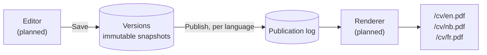

# Core Sample

**One CV, every language, never out of date.** Core Sample is the pipeline behind the CV on [ralanwilliams.com](https://ralanwilliams.com): a single versioned source in PostgreSQL, published per language to links that never change.

A CV usually lives as a pile of copies: the PDF sent last spring, the Word file on the desktop, a translation that missed the last two jobs. Core Sample replaces them with one source of truth. Every save is kept, every language is checked against the others, and `/cv/en.pdf` always serves the current published version, so a link sent to a recruiter never goes stale.

> This repository also holds the website itself, in [`public/`](public/).

## Status

Work in progress. The data layer is built; the editor and renderer come next.

| Part | State |
|---|---|
| Content model and database schema | Done |
| Database rules: history, translations, publishing | Done, with 56 schema tests |
| Migrations to Supabase | Done |
| Editor (edit, save, publish) | Planned |
| Renderer (HTML and PDF per language) | Planned |
| Public download links | Planned |

## How it works



- **Nothing is overwritten.** Each save stores a complete new version, so history, diffs between any two versions and restores are correct by construction.
- **Languages can't drift apart.** English, Norwegian and French share one structure. Adding a job in English shows up as missing in the other two, and a language with missing text can't be published.
- **Stale translations are flagged.** Each translation remembers the English text it came from, so the editor knows when the English has changed since.
- **Publishing is per language and reversible.** English can go live while French is still being translated, and rolling back is just publishing an older version.
- **The database enforces the rules.** Constraints and triggers in PostgreSQL guard every invariant, so even two open browser tabs can't overwrite each other's work.

## Tech stack

- .NET 10 and EF Core 10
- PostgreSQL on Supabase, in a dedicated `cv` schema kept out of Supabase's public APIs
- Reviewed SQL for constraints, triggers and views, covered by a SQL test suite

## Design decisions

Each significant decision is written up as an Architecture Decision Record (ADR): the context, what was decided, the trade-offs, and the alternatives that were rejected.

<!-- adr-index:start -->
| ADR | Decision | Status | Date |
|---|---|---|---|
| [0001](docs/adr/0001-cv-content-model.md) | CV content model: an immutable, versioned tree with per-locale text | Accepted | 2026-10-06 |
<!-- adr-index:end -->

## Repository layout

```
├── public/              the website (ralanwilliams.com)
├── src/Cv.Data/         EF Core model, configurations and migrations
├── src/Cv.Migrator/     console app that applies migrations
├── tests/db/            SQL schema tests
├── docs/adr/            Architecture Decision Records
├── docs/cv-database.md  database setup and migration guide
└── scripts/             helper scripts
```

## Getting started

```powershell
dotnet tool restore
dotnet build Cv.slnx
```

Connecting to Supabase, applying migrations and running the schema tests are covered step by step in [docs/cv-database.md](docs/cv-database.md).

## Writing an ADR

Copy [docs/adr/template.md](docs/adr/template.md) to `docs/adr/NNNN-short-title.md` with the next free number. The table under *Design decisions* updates itself when the ADR reaches `master`. To refresh it locally, run `./scripts/Update-AdrIndex.ps1`.
